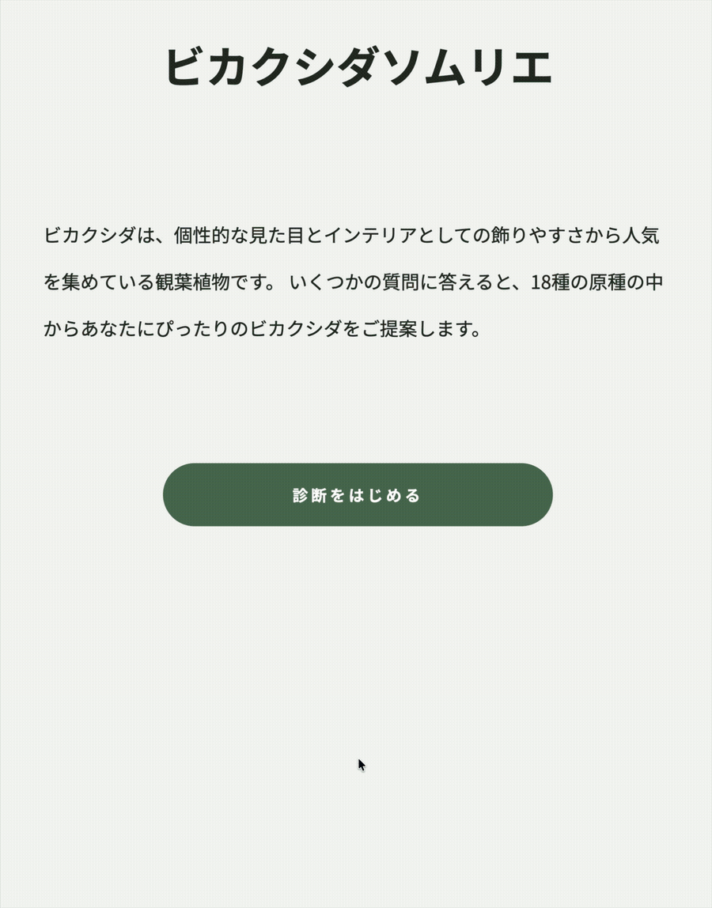

# ビカリエ
ビカクシダの原種18種から、育成環境や好みに合った品種をソムリエのように提案してくれる診断Webアプリケーションです。

## アプリ概要
6つの質問に回答すると、回答内容と各品種の特徴を比較し、スコアの高いビカクシダを診断結果として表示します。

  

## 概要
ビカクシダの原種18種から、数問の質問に答えることでおすすめを診断するWebアプリです。

## URL
https://www.bikalier.com

## 制作目的
- JavaScriptを用いた診断ロジックの実装を通じて、配列、オブジェクト、条件分岐、繰り返し処理、DOM操作への理解を深める
- 自身の趣味である観葉植物を題材にし、実際の利用者の視点に立ったUIや機能の設計を経験する
- 一般的な観葉植物診断ではなく、ビカクシダの原種に対象を絞ることで、専門性とインパクトのあるアプリを制作する

## 使用技術
* HTML
* CSS
* JavaScript
* Git / GitHub
* GitHub Pages
* カスタムドメイン

## 機能
- 6つの質問に対し、それぞれ3つの回答ボタンを選択し回答する
- 回答内容とビカクシダ原種18種の特徴を比較してスコア付け、ユーザーの希望に最も類似した特徴を持つ品種を保持する
- スコアの高い品種を診断結果として表示する
- 診断を最初からやり直すボタン、育て方を検索するボタンを結果画面に実装
- スマートフォンとPCに対応したレスポンシブ表示

## 工夫した点
- 生成AIの使用は情報収集と問題発生時の質問に限定し、処理の目的と動作を確認しながら自分の手で実装した
- 品種情報をオブジェクトの配列として管理し、回答内容との比較や結果表示に利用した
- 各品種と回答内容を比較してスコアを算出し、スコア順に並べて結果を表示する診断ロジックを実装した
- GitHub Flowを意識し、IssueやPull Requestを都度使用しmainブランチへ反映した
- スマートフォンでの利用を主軸としたモバイルファースト設計を採用した
- 回答ボタンを大きくし、選択肢の間隔を確保することで誤操作を防いだ
- GitHub Pagesと独自ドメインを利用して公開した

## 今後の改善

- 診断結果について、どの回答が品種の特徴と一致したのかを表示し、診断理由を分かりやすくする
- 同率1位の品種が複数ある場合は、該当する品種数を先に案内したうえで、すべての候補を一覧表示する
- カード内にボタンを実装することで、同率1位の各品種からそれぞれの育て方を検索できるようにする
- 品種ごとに複数の画像を登録し、診断結果にランダムで表示する
